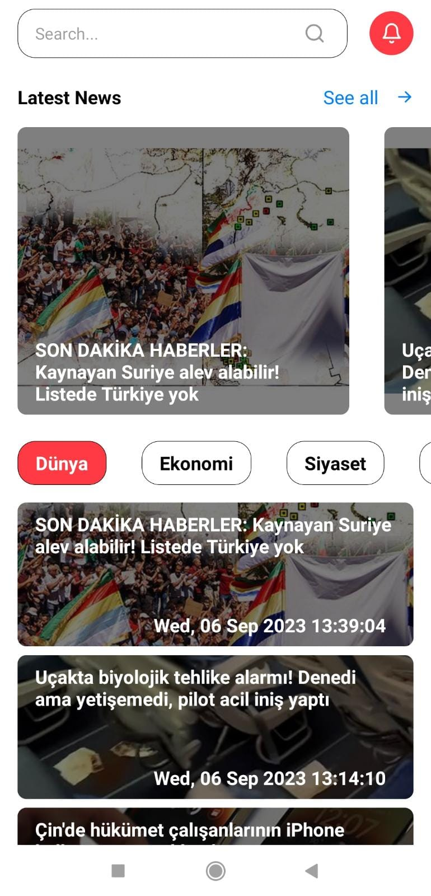
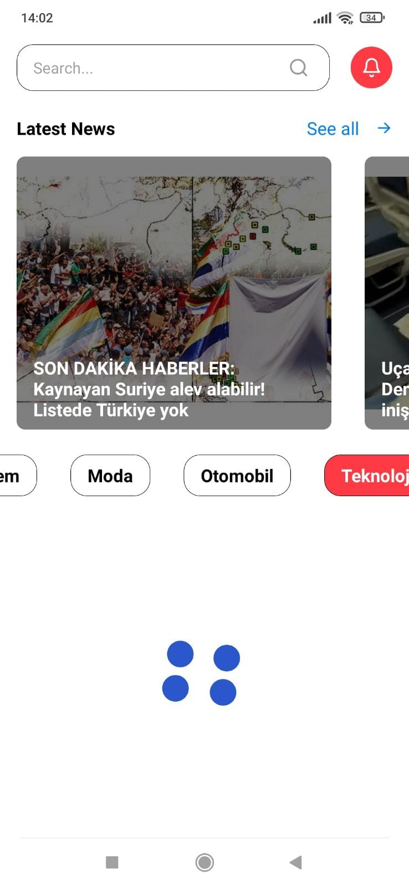
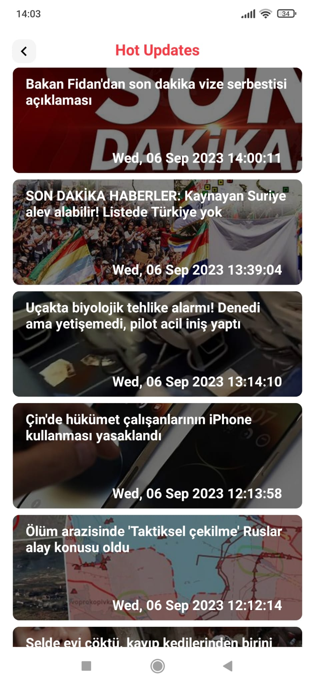

# Weather Project

## Overview

**NewsApp** is a Turkish news application that allows you to stay updated on Turkish news in real-time, all wrapped in a stylish React Native package. With NewsApp, you can effortlessly access the latest news while enjoying a seamless blend of functionality and aesthetics.

## Project Preview

<div style="display: flex; flex-direction: row; justify-content: center;">
  <div style="display: flex; flex-direction: row; margin-right: 20;">
    
    
  </div>
  
  <div style="display: flex; flex-direction: row; margin-right: 20px;"> 
    
     
  </div>
  </div>

## Design Notice

The design is personally crafted, presenting a minimalistic layout for the news application.
I executed a straightforward design approach, highlighting essential news information.

This news application is developed using the following technologies and features:

## Features

- To harness the power of Milliyet's RSS feed, we utilize an RSS parser to extract data from the XML format. This parsing process enables us to access the structured information within the RSS feed, including article titles, descriptions, publication dates, and more.
- The data we retrieve from the RSS feed often contains HTML tags that need to be cleaned up for a better user experience. Our application intelligently removes these tags to ensure that the content is presented in a neat and readable format.
- We understand that organizing news content is essential for our users. To achieve this, we categorize news articles by topic, making it easier for you to find and explore stories that interest you the most.

## Technologies Used

- React Native: A widely-used JavaScript framework for building cross-platform mobile applications.
- Milliyet RSS Used: We rely on Milliyet's RSS feed to provide a diverse selection of news articles and updates.
- RSS Parser Implemented: Our application employs an RSS parsing library to extract structured data from Milliyet's RSS feed. This enables us to process and present news articles efficiently.
- HTML Tag Cleanup Implemented: We've implemented techniques to remove HTML tags from the retrieved data, ensuring a clean and readable presentation of content.
- Categorization Implemented: Our app categorizes news articles by topic, making it easier for users to discover stories that interest them.
- These features collectively contribute to our user-friendly news application, delivering the latest Milliyet news in an accessible and organized format.

## Getting Started

To run this project locally, follow these steps:

1. **Clone the repository:**

   ```bash
   git clone https://github.com/AtakanAlkn/NewsApp-ReactNative.git


   ```

2. **Navigate to the project directory:**

   cd NewsApp-ReactNative.git

3. **Install dependencies:**

   npm install
   or
   yarn install

4. **Start the development server:**

   npm start
   or
   yarn start

5. **Run on iOS or Android:**

   To run the app on iOS or Android simulators/emulators, use the following commands respectively:

   npm run ios
   npm run android
   or
   yarn ios
   yarn android

**Congratulations!**
You've successfully set up and started the project locally. Feel free to explore the code, make changes, and test new features.

**Troubleshooting**
If you encounter any issues during the setup process or while running the app, consider the following steps:

Double-check that you've correctly configured your environment variables in the .env file.
Ensure you have Node.js and npm (or yarn) installed on your system.
Make sure you have Xcode (for iOS development) or Android Studio (for Android development) properly set up.
Clear the npm or yarn cache and node_modules directory, then run the installation step again.
If the problem persists, please open an issue on our GitHub repository. We'll be glad to assist you!

## License

This repository is licensed under the [MIT License](LICENSE).

## Contact

If you have any questions, suggestions, or just want to connect, you can reach me at:

- Email: alkan.atakan@outlook.com
- LinkedIn: [Atakan Alkan](https://www.linkedin.com/in/atakanalkn/)
